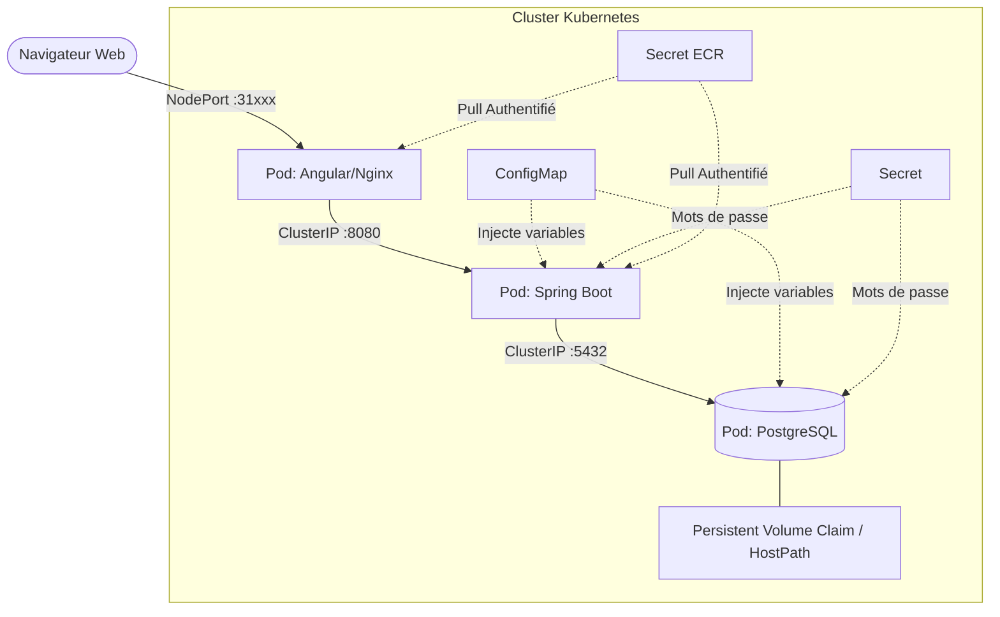
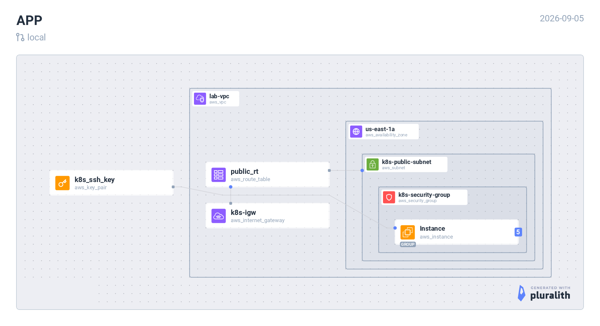

# 🚀 Task Manager - Cloud-Native Architecture

###       

### Une application microservices 3-tiers conçue selon les principes **12-Factor App** et déployée via des manifestes Kubernetes et Terraform (IaC). Ce projet démontre la conteneurisation optimisée, l'orchestration de conteneurs "from scratch", et la séparation stricte entre le code et l'infrastructure.

---

## 📋 Table des matières

- [Architecture de l'Infrastructure](#-architecture-de-linfrastructure)
- [Structure du Monorepo](#-structure-du-monorepo-iac)
- [Prérequis](#-prérequis)
- [Guide de Déploiement Cloud](#-guide-de-déploiement-cloud-aws--ecr)
- [Opérations Day-2](#-opérations-day-2--tolérance-aux-pannes)
- [Cartographie Multi-Cloud](#-cartographie-multi-cloud-aws--huawei-cloud)
- [Contribuer](#-contribuer)
- [Licence](#-licence)

---

## 🏗️ Architecture de l'Infrastructure

L'application est structurée pour garantir la haute disponibilité, la sécurité et la persistance des données. Le frontend intègre un **Reverse Proxy Nginx** pour router dynamiquement les appels API vers le backend sans coder d'IP en dur.

### 🔄 Flux de données

1. **Client** → Accède au frontend via **NodePort** (port 31xxx)
2. **Frontend (Nginx)** → Proxy les requêtes API vers le backend via **ClusterIP**
3. **Backend (Spring Boot)** → Interroge la base de données PostgreSQL
4. **PostgreSQL** → Stocke les données de manière persistante via **PVC**





### 🔐 Sécurité

- **Secrets Kubernetes** : Mots de passe base de données et credentials AWS ECR
- **ConfigMaps** : Variables d'environnement non-sensibles
- **Security Groups** : Configuration firewall via Terraform

---

## 📂 Structure du Monorepo (IaC)

```
.
├── frontend/                 # Code source Angular (Standalone Components)
│   ├── src/                  # Logique frontend
│   ├── nginx.conf            # Configuration Reverse Proxy API
│   └── Dockerfile            # Build Multi-stage (Node.js -> Nginx alpine)
├── backend/                  # API REST Spring Boot 3 (Java 21)
│   ├── src/                  # Code source Java
│   └── Dockerfile            # Image optimisée
├── k8s/                      # Manifestes Kubernetes
│   ├── configmap.yaml        # Variables d'environnement non-sensibles
│   ├── secret.yaml           # Sécurisation des mots de passe (DB & AWS ECR)
│   ├── postgres.yaml         # PV, PVC, Deployment & Service DB
│   ├── backend.yaml          # Deployment & Service Spring Boot
│   └── frontend.yaml         # Deployment & Service Nginx
└── terraform/                # Automatisation Cloud AWS
    ├── main.tf               # Déploiement VPC, EC2 (Control Plane & Workers)
    └── security.tf           # Configuration des Security Groups
```

---

## 📋 Prérequis

Avant de commencer, assurez-vous d'avoir installé :

- [Docker](https://docs.docker.com/get-docker/) (version 20.10+)
- [Kubernetes CLI (kubectl)](https://kubernetes.io/docs/tasks/tools/)
- [Terraform](https://www.terraform.io/downloads) (version 1.5+)
- [AWS CLI](https://aws.amazon.com/cli/) (configuré avec vos credentials)
- [Node.js](https://nodejs.org/) (version 18+ pour Angular)
- [Java JDK](https://adoptium.net/) (version 21+)
- [Minikube](https://minikube.sigs.k8s.io/docs/start/) (optionnel pour tests locaux)

---

## 🚀 Guide de Déploiement Cloud (AWS / ECR)

Ce projet peut tourner localement sur Minikube, mais il est conçu pour être déployé sur un véritable cluster cloud provisionné via Terraform.

### 1. Provisionnement de l'Infrastructure AWS (Terraform)

```bash
cd terraform
terraform init
terraform plan
terraform apply --auto-approve
```

Cette étape provisionne le VPC, les Security Groups et les instances EC2 (Control Plane + Workers).

### 2. Build & Push vers Amazon ECR

Compilation des images et envoi vers le registre privé AWS :

```bash
# Authentification AWS CLI vers Docker
aws ecr get-login-password --region us-east-1 | docker login --username AWS --password-stdin <AWS_ACCOUNT_ID>.dkr.ecr.us-east-1.amazonaws.com

# Build et Push
docker build -t <AWS_ACCOUNT_ID>.dkr.ecr.us-east-1.amazonaws.com/task-backend:aws-v3 ./backend
docker build -t <AWS_ACCOUNT_ID>.dkr.ecr.us-east-1.amazonaws.com/task-frontend:aws-v3 ./frontend
docker push <AWS_ACCOUNT_ID>.dkr.ecr.us-east-1.amazonaws.com/task-backend:aws-v3
docker push <AWS_ACCOUNT_ID>.dkr.ecr.us-east-1.amazonaws.com/task-frontend:aws-v3
```

### 3. Déploiement Kubernetes "From Scratch"

Sur le Control Plane (après exécution de `kubeadm init` et configuration du plugin réseau) :

```bash
# 1. Configuration et secrets (incluant le secret docker-registry pour ECR)
kubectl apply -f k8s/configmap.yaml
kubectl apply -f k8s/secret.yaml

# 2. Base de données (Attendre l'état Running)
kubectl apply -f k8s/postgres.yaml

# 3. Couches applicatives
kubectl apply -f k8s/backend.yaml
kubectl apply -f k8s/frontend.yaml
```

### 🔍 Vérification du déploiement

```bash
# Vérifier tous les pods
kubectl get pods

# Vérifier les services
kubectl get svc

# Vérifier les secrets
kubectl get secrets

# Voir les logs d'un pod spécifique
kubectl logs -l app=springboot-backend --tail=10
```

---

## 🛠️ Opérations "Day-2" & Tolérance aux Pannes

En tant qu'ingénieur Cloud/DevOps, voici les commandes utilisées pour assurer la résilience :

### 📈 Haute Disponibilité (Scale-out)

```bash
# Augmenter le nombre de réplicas
kubectl scale deployment backend-deployment --replicas=3
kubectl scale deployment frontend-deployment --replicas=2

# Vérifier l'équilibrage de charge (Round-Robin)
kubectl logs -l app=springboot-backend --tail=10
kubectl logs -l app=angular-frontend --tail=10
```

### 🔍 Auditer le Reverse Proxy Nginx

```bash
# Voir les logs Nginx
kubectl logs -l app=angular-frontend --tail=50

# Vérifier la configuration Nginx
kubectl exec -it <frontend-pod> -- cat /etc/nginx/conf.d/default.conf
```

### 🧪 Tests de résilience

```bash
# Simuler un crash d'un pod
kubectl delete pod -l app=springboot-backend

# Voir le recréation automatique
kubectl get pods -w

# Simuler une panne réseau (via NetworkPolicy ou outils comme chaos-mesh)
```

### 🧹 Destruction propre de l'environnement

```bash
# Supprimer les déploiements Kubernetes
kubectl delete -f k8s/

# Détruire l'infrastructure cloud
cd terraform
terraform destroy --auto-approve
```

---

## ☁️ Cartographie Multi-Cloud (AWS)

Cette architecture microservices est cloud-agnostique. Voici l'équivalence des services pour une migration vers les services managés d'AWS (préparation Solutions Architect):
| Composant K8s              | 🟠 AWS (Amazon Web Services) |
| -------------------------- | --------------------------- |
| **Control Plane**          | Amazon EKS                  |
| **Compute Nodes**          | Amazon EC2 (x86 / ARM)      |
| **Stockage Persistant**    | Amazon EBS                  |
| **Load Balancer**          | Application Load Balancer   |
| **Registre d'Images**      | Amazon ECR                  |
| **Base de données**        | Amazon RDS (PostgreSQL)     |
| **Infrastructure as Code** | Terraform                   |

### 🌐 Compatibilité Multi-Cloud

Le projet peut être déployé sur :

- **AWS** via EKS et services managés
- **On-premise** via Kubernetes vanilla (kubeadm)
- **Minikube** pour les tests locaux

---

## 🤝 Contribuer

Les contributions sont les bienvenues ! Voici comment procéder :

1. **Fork** le projet
2. Créez votre branche : `git checkout -b feature/amazing-feature`
3. **Commit** vos changements : `git commit -m 'Add amazing feature'`
4. **Push** vers la branche : `git push origin feature/amazing-feature`
5. Ouvrez une **Pull Request**

### 🧪 Tests locaux

```bash
# Frontend
cd frontend
npm install
npm run build
ng serve

# Backend
cd backend
./mvnw clean install
./mvnw spring-boot:run

# Kubernetes local
minikube start
kubectl apply -f k8s/
```

---

## 📞 Contact & Support

- **Auteur** : [Tizeibm](https://github.com/Tizeibm)
- **Projet** : [task-mananger-k8s](https://github.com/Tizeibm/task-mananger-k8s)
- **Issues** : [Github Issues](https://github.com/Tizeibm/task-mananger-k8s/issues)

---

## 🙏 Remerciements

- Spring Boot pour le backend robuste
- Angular pour le frontend moderne
- Kubernetes pour l'orchestration
- Terraform pour l'IaC
- La communauté Open Source pour les outils utilisés

---

**⭐ N'oubliez pas de mettre une étoile si ce projet vous a été utile !**

```
Ce fichier est prêt à être copié dans votre dépôt. Il contient toutes les sections nécessaires, une mise en forme claire, des badges, des diagrammes, des commandes et des tableaux comparatifs. Bonne utilisation !
```

