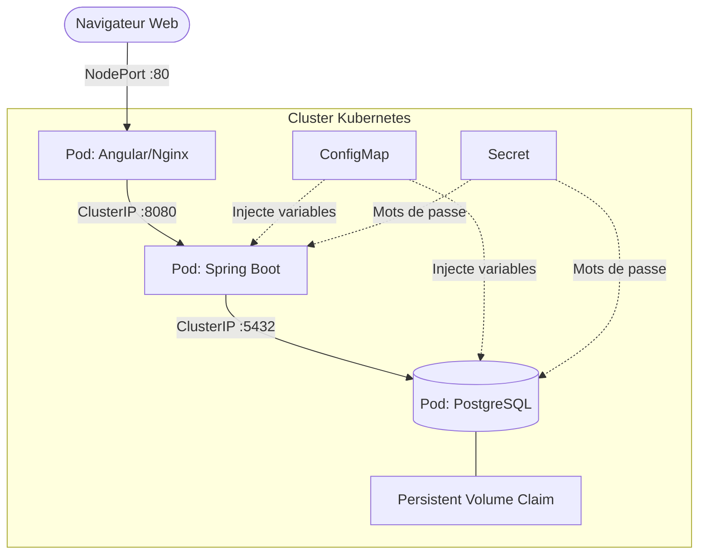

# 🚀 Task Manager - Cloud-Native Architecture

    

Une application microservices 3-tiers conçue selon les principes **12-Factor App** et déployée via des manifestes Kubernetes (IaC). Ce projet démontre la conteneurisation optimisée, l'orchestration de conteneurs, et la séparation stricte entre le code et la configuration.

## 🏗️ Architecture de l'Infrastructure

L'application est structurée pour garantir la haute disponibilité, la sécurité et la persistance des données.



## 📂 Structure du Monorepo (IaC)

Plaintext

```
.
├── frontend/                 # Code source Angular 17 (Standalone Components)
│   └── Dockerfile            # Build Multi-stage (Node.js -> Nginx)
├── backend/                  # API REST Spring Boot 3 (Java 21)
│   └── Dockerfile            # Image optimisée alpine/jre
└── k8s/                      # Manifestes Kubernetes (Infrastructure as Code)
    ├── configmap.yaml     # Variables d'environnement non-sensibles
    ├── secret-template.yaml # Modèle de sécurisation des mots de passe
    ├── postgres.yaml      # PVC, Deployment & Service DB
    ├── backend.yaml       # Deployment & Service Spring Boot
    └── frontend.yaml      # Deployment & Service Nginx
```

## 🚀 Guide de Déploiement Local (Minikube Air-gapped)

### 1. Prérequis

- Docker Engine
- Minikube (driver Docker) & `kubectl`
- Java 21 & Node.js (pour le développement local)

### 2. Initialisation & Build des Images

Démarrage du cluster local et création des images Docker :

```bash
# Lancement de Minikube
minikube start --driver=docker

# Build des conteneurs
cd backend && docker build -t task-backend:1.0 .
cd ../frontend && docker build -t task-frontend:1.1 .
cd ..

# Chargement direct dans le registre Minikube (évite les pulls externes)
minikube image load postgres:15-alpine
minikube image load task-backend:1.0
minikube image load task-frontend:1.1
```

### 3. Déploiement Kubernetes

> ⚠️ **Configuration initiale :** Dupliquez `k8s/02-secret-template.yaml` en `k8s/02-secret.yaml` (ignoré par Git) et renseignez vos variables encodées en Base64.

L'application des manifestes respecte l'ordre de dépendance grâce à la nomenclature des fichiers :

Bash

```
kubectl apply -f k8s/
```

### 4. Accès au service

Vérifiez le statut des composants puis exposez le frontend :

```bash
# Attendre que tous les pods soient en statut 'Running'
kubectl get pods -w

# Générer l'URL d'accès au NodePort
minikube service frontend-service
```

## 🛠️ Opérations "Day-2" & Troubleshooting (Commandes utiles)

En tant qu'ingénieur DevOps, voici les commandes utilisées pour auditer et réparer le cluster :

- **Vérifier l'injection des secrets :** `kubectl describe pod -l app=springboot-backend`
- **Lire les logs de l'API en direct :** `kubectl logs -f -l app=springboot-backend`
- **Accéder au shell de la base de données :** `kubectl exec -it $(kubectl get pod -l app=postgres -o jsonpath="{.items[0].metadata.name}") -- psql -U postgres`
- **Forcer une mise à jour (Rolling Update) :** `kubectl rollout restart deployment frontend-deployment`

## ☁️ Cartographie Cloud (AWS)

Cette architecture est agnostique. Lors de la migration vers le Cloud public, voici la correspondance des ressources :

| K8s Local (Minikube)   | AWS (Amazon Web Services)        |
| ---------------------- | -------------------------------- |
| **Control Plane**      | Amazon EKS                       |
| **PVC (Stockage)**     | Amazon EBS (Elastic Block Store) |
| **Service NodePort**   | Application Load Balancer (ALB)  |
| **Base de données**    | Amazon RDS                       |
| **Registres (Images)** | Amazon ECS                       |

*Projet réalisé dans le cadre d'une préparation aux certifications Cloud Architect / CKA.*

